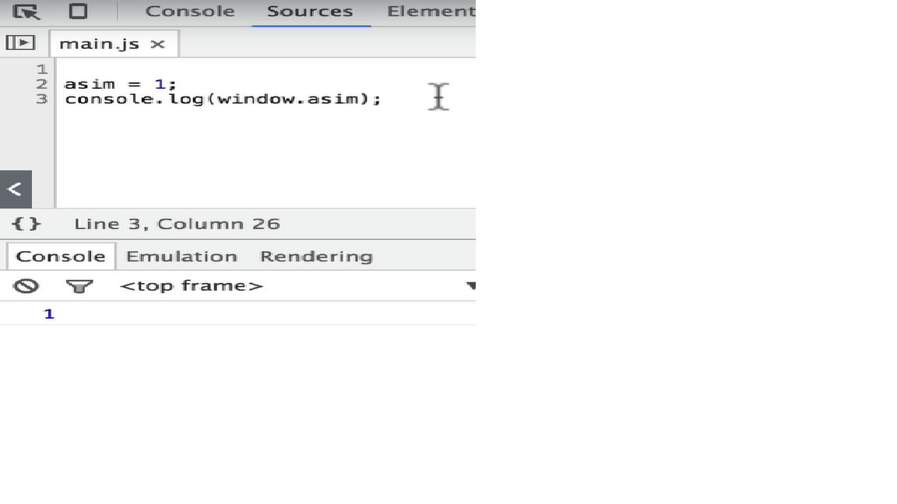

===============
1. Strict mode
===============

Strict mode allows you to place a program or a function in a strict operating context.

It makes debugging easier.

"use strict"; //way to enable strict mode

In strict mode, using a variable before it's been defined causes an error.

 