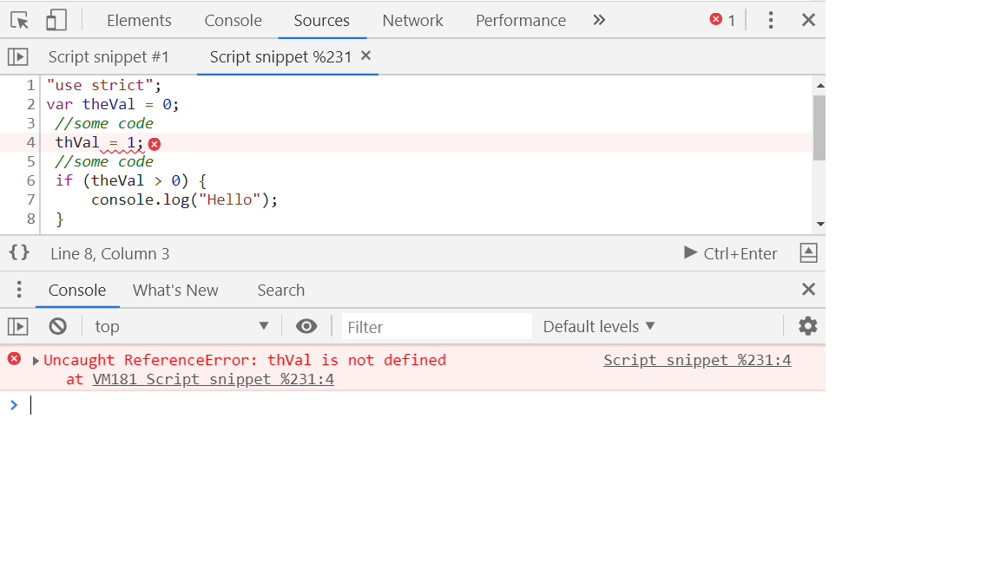
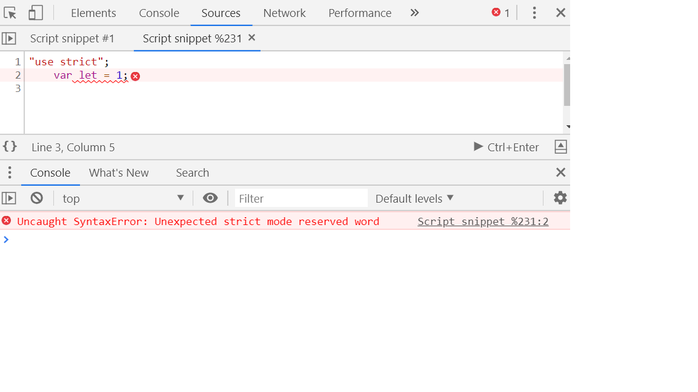
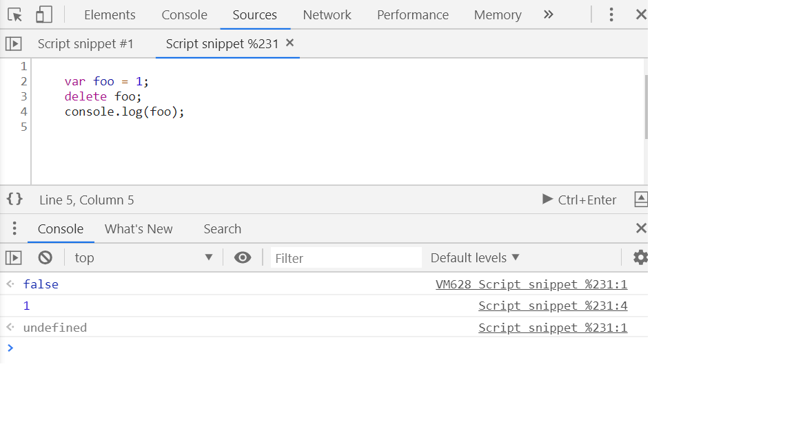
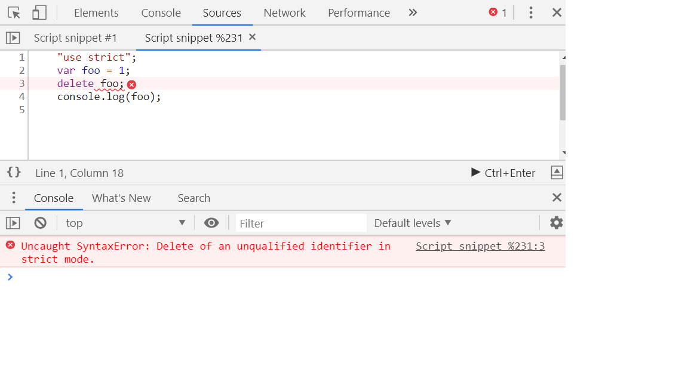
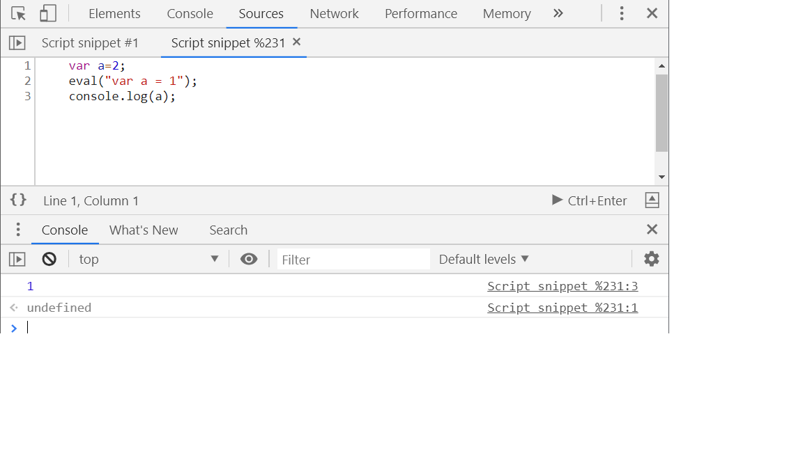
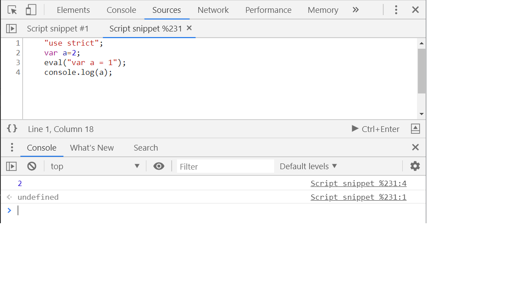
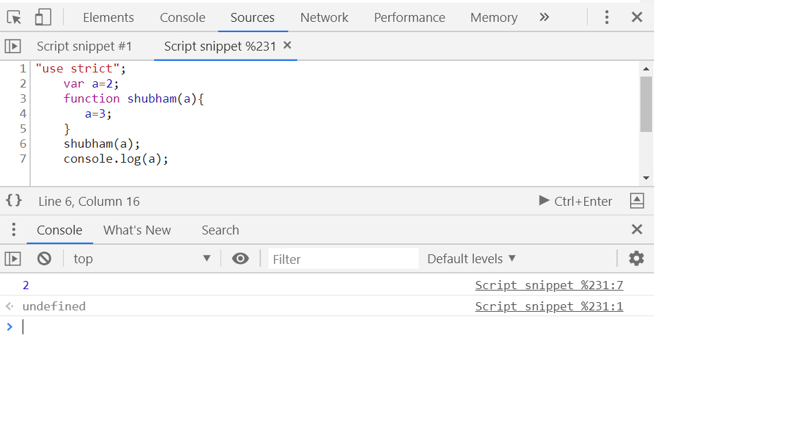
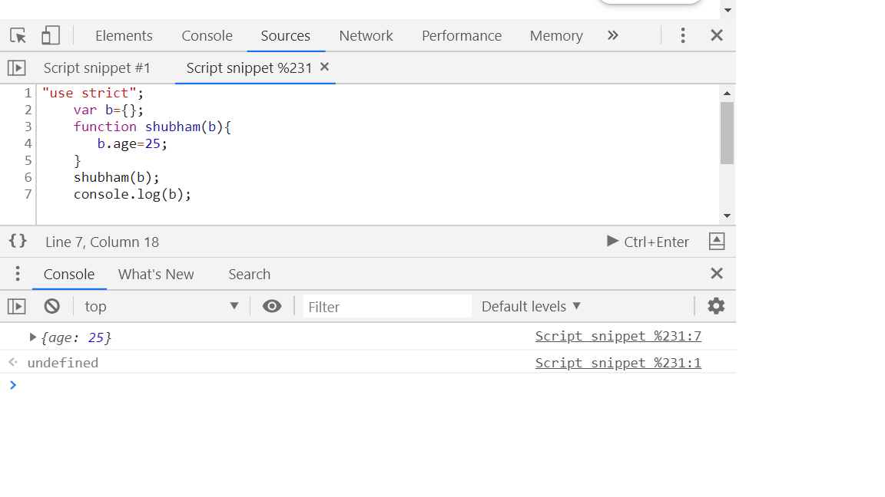

1. Strict mode
=========================

Strict mode allows you to place a program or a function in a strict operating context.

It makes debugging easier.

"use strict"; //way to enable strict mode

In strict mode, using a variable before it's been defined causes an error.

 For example:

 var theVal = 0;
 //some code
 thVal = 1;
 //some code
 if (theVal > 0) {
     console.log("Hello");
 }

 In above example, the typo of theVal "thVal" is assigned a value. So the if condition will fail. JS creates a global var "thVal" and assigns it value 1. 

Eg: 
"use strict";
var theVal = 0;
 //some code
 thVal = 1;
 //some code
 if (theVal > 0) {
     console.log("Hello");
 }

OUTPUT:: Uncaught ReferenceError: thVal is not defined.

So, the "use strict" eleminates accidental global variables and variable declaration without "var" keyword.

Another feature of "use strict" is it doesn't allow you to use the future reserved words as per your choice, avoiding conflicts.

Eg: "use strict";
    var let = 1;
OUTPUT:: Uncaught SyntaxError: Unexpected strict mode reserved word.

Another feature of "strict mode" is You cannot delete variables, functions and function arguments.

Eg: 
    var foo = 1;
    delete foo;
    console.log(foo); //undefined

With "use strict":

Another feature of "use strict" is It makes "eval" keyword more safer.

Eg:
    var a=2;
    eval("var a = 1");
    console.log(a);

With "use strict":

It means the expression and variables inside the eval doesn't pollute the global namespace.

2. Does JS pass Variables by value or by reference?
====================================================

Straight answer is the primitive types such as string, number, booleans are passed by value and the objects are passed by reference. 

What pass by value is and what pass by reference is?

Pass by value:
    If you change the value of a primitive type inside the function, it won't affect the primitive type in the outer scope.

    "use strict";
    var a=2;
    function shubham(a){
       a=3;
    }
    shubham(a);
    console.log(a); //2

    It's passing a copy of A, so anything we do with A inside the function won't affect the actual variable A.

Pass by reference:
    When we are passing something by reference means that we are passing something that points to something else(NOT the copy of the object).
    
    "JS passes Objects by reference"

    When we try to change the property of the object from within the function, the change will be reflected in the outer scope.
    Eg1: Changed the property of original object

    "use strict";
    var b={};
    function shubham(b){
       b.age=25;
    }
    shubham(b);
    console.log(b);

    Eg2: Original object property is mutated

    "use strict";
    var b={age: "26"};
    function shubham(b){
       b.age=25;
    }
    shubham(b);
    console.log(b);

3. Rest Operator
==========================

For example, we want to sum up the numbers:

"use strict";
    function shubhamSum(a, b, c){
       console.log(arguments); //to print all the arguments it's receiving
       return a+b+c;
    }
    shubhamSum(1,2,3);

 

