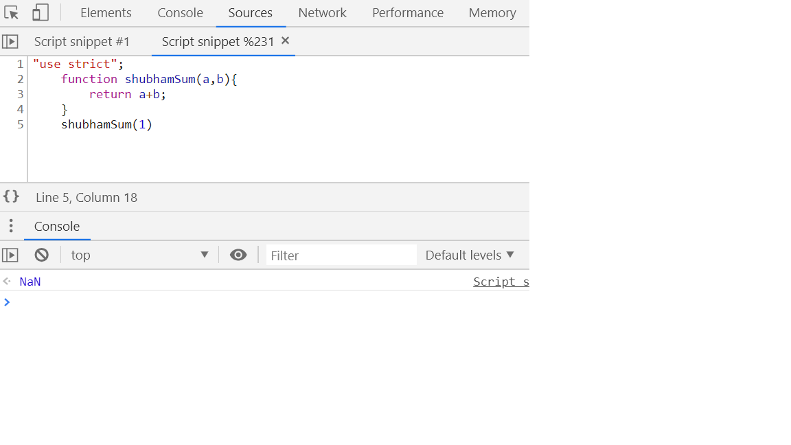

# 1. Strict mode #

Strict mode allows you to place a program or a function in a strict operating context.

It makes debugging easier.

"use strict"; //way to enable strict mode

In strict mode, using a variable before it's been defined causes an error.


 For example:
```javascript

 var theVal = 0;
 //some code
 thVal = 1;
 //some code
 if (theVal > 0) {
     console.log("Hello");
 }
```
 In above example, the typo of theVal "thVal" is assigned a value. So the if condition will fail. JS creates a global var "thVal" and assigns it value 1. 

Eg: 
```javascript
"use strict";
var theVal = 0;
 //some code
 thVal = 1;
 //some code
 if (theVal > 0) {
     console.log("Hello");
 }
```

OUTPUT:: Uncaught ReferenceError: thVal is not defined.


So, the "use strict" eleminates accidental global variables and variable declaration without "var" keyword.

Another feature of "use strict" is it doesn't allow you to use the future reserved words as per your choice, avoiding conflicts.

Eg:
```javascript
 "use strict";
    var let = 1;
```
OUTPUT:: Uncaught SyntaxError: Unexpected strict mode reserved word.


Another feature of "strict mode" is You cannot delete variables, functions and function arguments.

Eg: 
```javascript
    var foo = 1;
    delete foo;
    console.log(foo); //undefined
```


With "use strict":


Another feature of "use strict" is It makes "eval" keyword more safer.

Eg:
```javascript
    var a=2;
    eval("var a = 1");
    console.log(a);
```


With "use strict":


It means the expression and variables inside the eval doesn't pollute the global namespace.

# 2. Does JS pass Variables by value or by reference? #
Straight answer is the primitive types such as string, number, booleans are passed by value and the objects are passed by reference. 

What pass by value is and what pass by reference is?

Pass by value:
    If you change the value of a primitive type inside the function, it won't affect the primitive type in the outer scope.

```javascript
    "use strict";
    var a=2;
    function shubham(a){
       a=3;
    }
    shubham(a);
    console.log(a); //2
```


    It's passing a copy of A, so anything we do with A inside the function won't affect the actual variable A.

Pass by reference:
    When we are passing something by reference means that we are passing something that points to something else(NOT the copy of the object).
    
    "JS passes Objects by reference"

    When we try to change the property of the object from within the function, the change will be reflected in the outer scope.
    Eg1: Changed the property of original object

```javascript
    "use strict";
    var b={};
    function shubham(b){
       b.age=25;
    }
    shubham(b);
    console.log(b);
```


    Eg2: Original object property is mutated
```javascript
    "use strict";
    var b={age: "26"};
    function shubham(b){
       b.age=25;
    }
    shubham(b);
    console.log(b);
```


# 3. Rest Operator #

It collapses a number of single elements or compresses a number of single elements into an array.

It is mostly used in the function signatures.

For example, we want to sum up the numbers:

```javascript
"use strict";
    function shubhamSum(a, b, c){
       console.log(arguments); //to print all the arguments it's receiving
       return a+b+c;
    }
    shubhamSum(1,2,3);
```


Eg:
```javaScript
"use strict";
    function shubhamSum(a,b){
        return a+b;
    }
    shubhamSum(1)
```
 <br>


All the arguments which gets passed to a function are always available as a variable/property called arguments.

We need not to declare it anywhere, it exists.

Eg:
```javaScript
    function shubhamSum(a,b){
        console.log(arguments);
        return a + b;
    }
    sum(1,2,3,4);
```


So, this is the only thing we had in JS which allow us to handle variable number of arguments.

Arguments is basically an array.

To handle the variable number of arguments, we can write:

```javaScript
    function shubhamSum(){
        var total = 0;
        for (var i=0; i< arguments.length; i++){
            total += arguments[i];
        }
        return total;
    }
    shubhamSum(1,2,3,4,5);
```


The problem is that by looking at the function signature we can't tell that how many arguments the function is going to take.

Other limitation of this code is that there is no fixxed and variable kind of arguments in this.

Super annoying thing is that the <b>arguments array</b> is not actually an array.


For example, while designing a login functionality for my website, we want 1 mandatory parameter <b>login method</b> and other variable number of parameters as optional.

Eg:
```javaScript
    function login(method){
        var option = arguments.slice(1); //[1,2,3,4].slice
        console.log(method);
        console.log(options);
    }
    login("facebook",1,2,3,4);
    //login("twitter", 2,4,6);
```

The <b>arguments.slice(1);</b> should drop the first element of the array and give last remaining arguments.

Here in our example, it should give:
```javaScript
    [1,2,3,4].slice(1); //[2,3,4]
```
  

  But when we try to slice arguments, BOOM we got an error!!!

  

Even though the <b>argument</b> looks like an array, but its not an array. It's some sort of built in structure which looks like an array, means it doesn't have the slice function, which is super annoying.

```javaScript
    function login(method){
        var options = Array.prototype.slice.call(arguments, 1);
        console.log(method);
        console.log(options);
    }
    login("facebook", 1,2,3,4)
```
  

The rest operator creates an array of the arguments passed to it.
Hence we can run array methods on it directly.

```js
"use strict";
    function login(...method){
        console.log(method.slice(2,5));
        console.log(method.push("Hi"))
        console.log(method);
    }
    login("facebook", 1,2,3,4)
```


Improved version of the above code:
```js
    "use strict";
    function login(method, ...options){
        console.log(method);
        console.log(options);
    }
    login("facebook", 1,2,3,4)
```


# 4. Spread Operator #

```js
    "use strict";
    var ar1 = [1, 2, 3];
    var ar2 = [4, 5, 6, ...ar1];
    console.log(ar2);
```


It does a kind of concat.

# 5. Template Literal or Template string #

```js
    var name="Shubham";
    var place= "world"
    var msg= ` Hello
        ${place}
        My name is ${name}`;
    console.log(msg);
```


We can also write the ternary operator inside the {}.

Eg: 
```js
    var isBold = true;
    var msg = `hello world my name is ${isBold ? "<b>Shubham</b>" : "Shubham"}`;
    console.log(msg);
```


Template string's application can be seen with the styled components in <b>ReactJS</b>.

Eg: 
```js
    function h1(strings) {
        return "<h1>" + strings[0] + "</h1>";
    }
    console.log(h1`ShUbHaM`); //<h1>ShUbHaM</h1>
```


Eg: 
```js
    function h1(strings){
        return  "<h1>" + strings[0] + "</h1>";
    }
    var name= "Shubham";
    var place= "World";
    console.log(h1`hello ${place} my name is ${name}`);
```
Only first part is getting printed out. It's breaking the string into 3 parts: "hello" , " my name is", " ".


We solve the above problem with Template String Tags.
# 6. Template String Tags #

```js
    function h1(strings, ...values){
        return  "<h1>" + strings[0] + "</h1>";
    }
    var name= "Shubham";
    var place= "World";
    console.log(h1`hello ${place} my name is ${name}`);
```

To print the whole string:

```js
    function h1(strings, ...values){
        var body = "";
        for (var i = 0; i< strings.length; i++){
            body += strings[i] + (values[i] || "");
        }
        //return "<h1>" + body + </h1> 
        return  `<h1>${body}</h1>`;
    }
    var name= "Shubham";
    var place= "World";
    console.log(h1`hello ${place} my name is ${name}`);
```


Eg: React styled components:
```js
    const button = styled.a`
        display: inline-block;
        border-radius:3px;
        width: 11rem;

        ${props => props.primary && .css`
            background: white;
            color:red;
        `}
    `
```

So, this is a way of implementing a very flexible reusable model of functions with strings which we call as <b>template string</b>.

