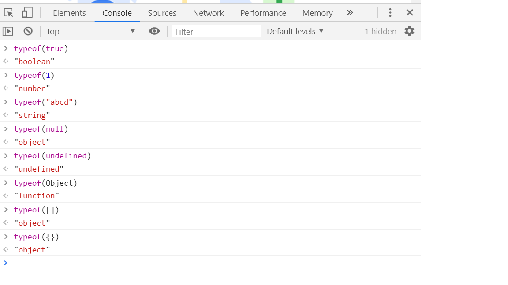
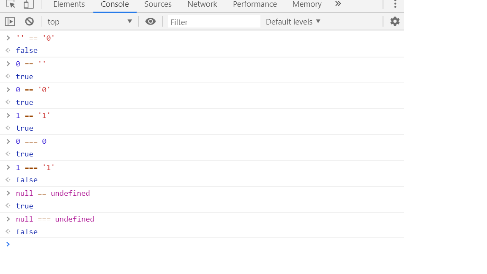
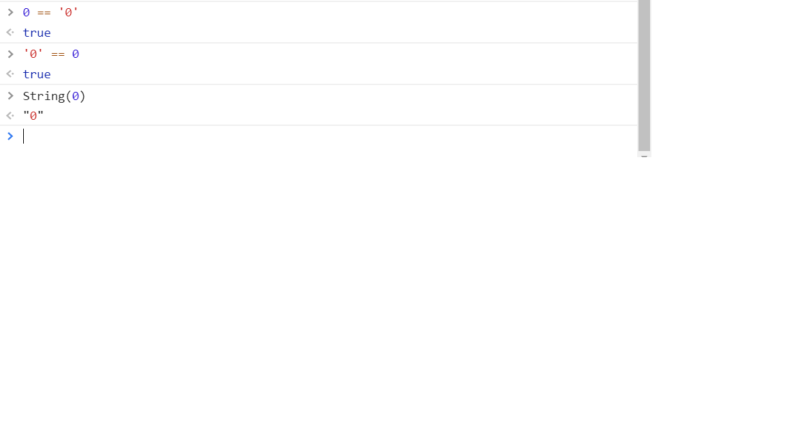
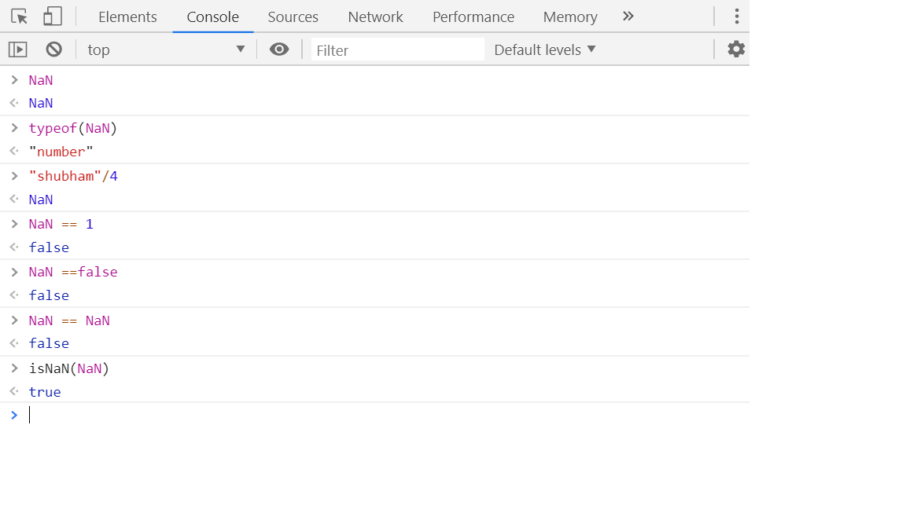
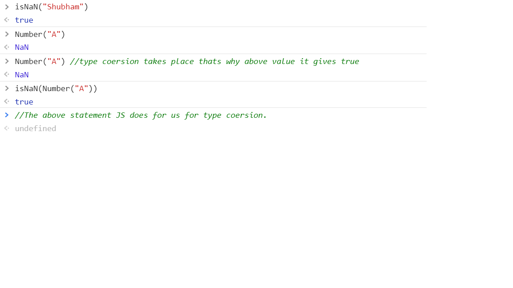
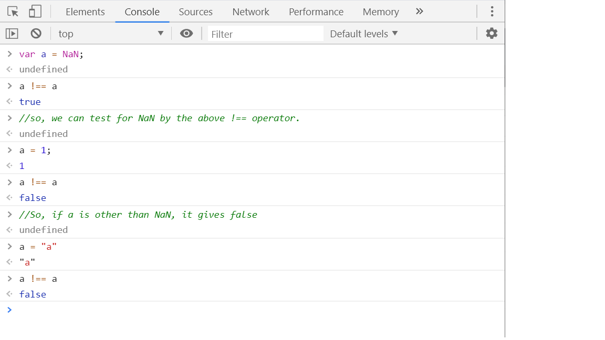

# Types and Equalities in JS: #

What are different types in JS?

1. Primitive types:
    Boolean // true, false
    Number  // 1, 2.3, 444.233
    String  // "Shubham", "Shubham Kushwaha"
    Null    // null
    Undefined   //undefined

2. Non-primitive types:

    Object  // {}, new Object()

The method typeOf():
It checks the type of a value.

```js
    typeof(true)
    "boolean"

    typeof(1)
    "number"

    typeof("abcd")
    "string"

    typeof(null)
    "object"

    typeof(undefined)
    "undefined"

    typeof([])
    "object"

    typeof({})
    "object"
```
In JS, it seems there are seemingly 2 redundent ways to represent the concept of no value: null and undefined.

But there is actually a subtle difference between the two. 

var a;
console.log(a);
//undefiend

<b>Undefined</b> is used by javascript to define the unknown value or uninitialized value, unknown variable, unknown function arguments and unknown properties.

Eg:
```js
var a;
undefined
window.shubham
undefined
```

So, undefined is a core js function uswd by js engine to inform you that if it's an uninitialized variable or unknown property of object or parameter missing from parameter's list or something whose value is not set. 

Null is a programmers way to state that the value is undefined. If JS engine doesnt find any value, it sets it to undefined.

```js
    var a= null;
    console.log(a); // null
```
In statically typed languages like java, null is not a value, it's just an absense of a value.
Eg, in java:
```java
    String a= null; //error
```
In JS, null is actually a value.

<b>typeof(null) is object. </b>

<b>typeof(undefined) is undefined. </b>

```js
    null == undefined // true

    undefined == null   //true
```

# 2. Difference between == & === in JS? #

Triple equal to is called strict requality as it checks the type as well as value whereas double equals to checks only value. 



JS tries to convert the type of value to help the programmers. Eg. For 0 == '0', it passes the value to the JS function String(0) which converts it to "0". Hence it becomes '0'== '0' which is obviously true.



This is called <b>type coersion</b> in JS. When there is non strict equality operator is used, then JS intelligently tries to coerce both values so that they are of the same type.


# 3. What is the type of NaN ? #

The type of NaN is number which indicstes that the value isn't a number, which is maybe a resukt ofd a bad calculation.

There is one strange property related to NaN:

Eg:
```js
    NaN
    typeof(NaN)
    "number"
    "shubham"/4
    NaN
    NaN == 1
    false
    NaN ==false
    false
    NaN == NaN
    false
    isNaN(NaN)
    true
```


NaN is not equal to NaN. So, fot the sake of comparison, there is one inbuilt function available in JS called isNaN.

But there is a problem with this function also:



So, <b>How to check if the variable is NaN?</b>

Since NaN is a single JS value which is not equal to itself, so the only fool proof way to check if a variable is NaN is by using <b>!==</b> . 




