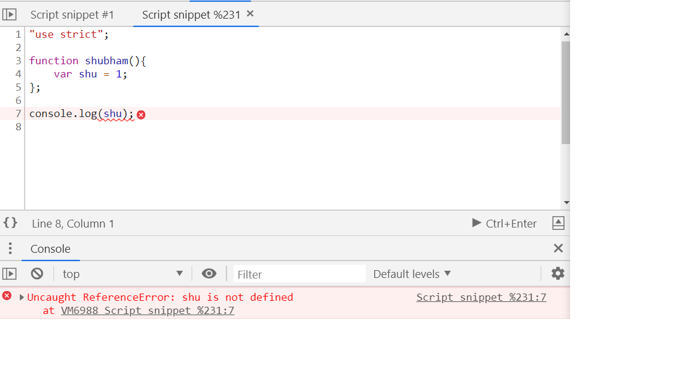
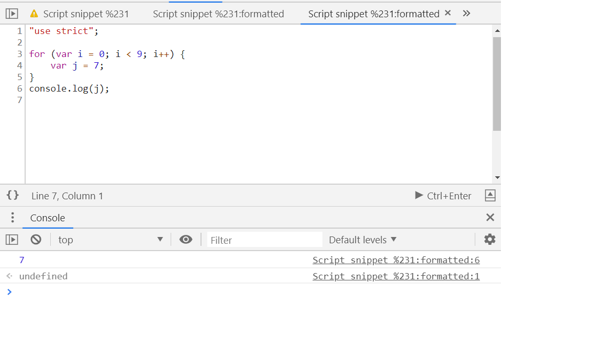
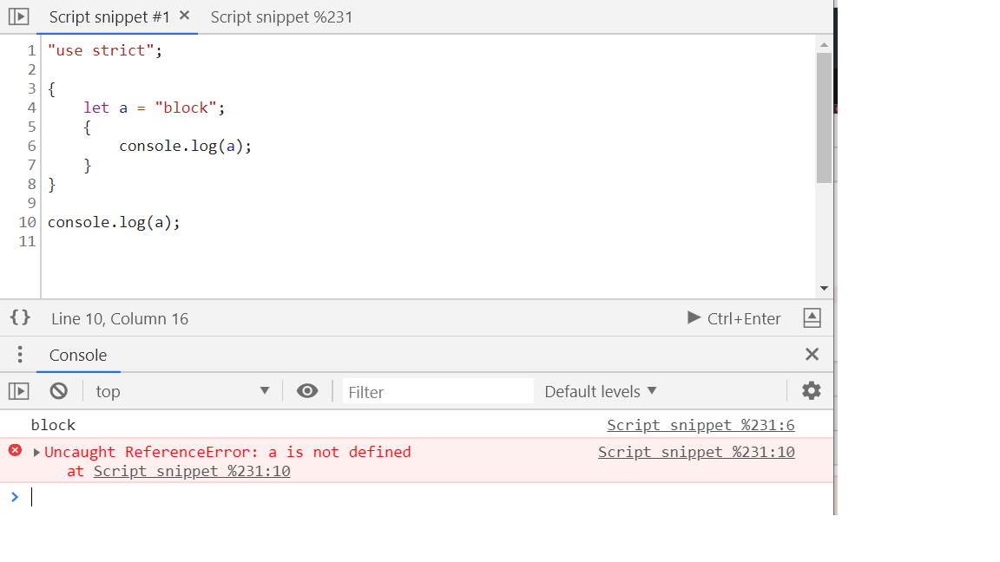
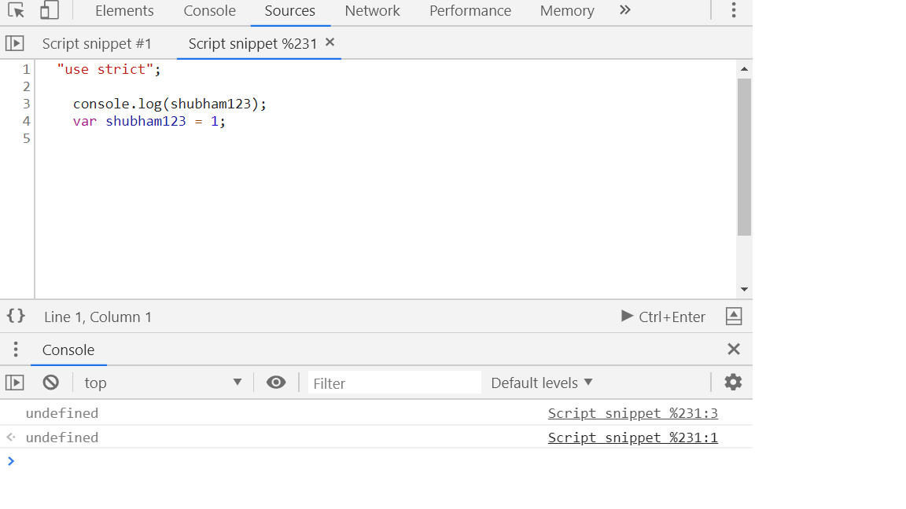
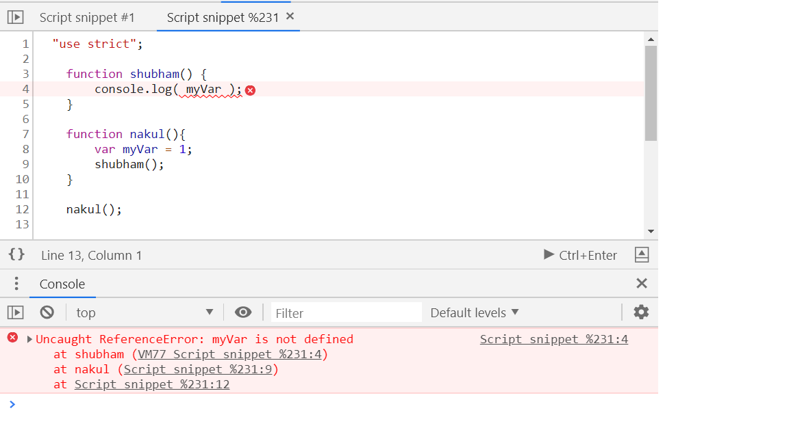

# Scope and Variable #

<h3>What are different scope in JS?</h3>

1. Global scope
2. Function scope
3. Block scope



1. Global scope:

Global variables are availabe throghout the application.

All the global variables are the properties of the window object.

2. Function scope:


Java and Python coders will think that it's having block scope. So, to demonstrate it, lets try out an example:



```js
    "use strict";

    for (var i = 0; i < 9; i++) {
        var j = 7;
    }
    console.log(j);
```

loops are having global scope and hence i and j are also having the global scope as well. 

<h4>ES6 feature for scoping</h4>

    <h5>Let and const keyword</h5>



```js
    "use strict";

    {
        let a = "block";
        {
            console.log(a);
        }
    }

    console.log(a);
```

const behaves same as let but the major difference is it'a value can't be reassigned.


```js
    for ( var i = 0; i < 5; i++>){
        console.log(i); // will be printed
    }
    console.log(i); //gives an error
```

# Variable Hoisting #

What is variable hoisting?

```js
    "use strict";

    console.log(a);
    var a = 1;

```



In strict mode, we cant assign a value to a variable without declaring it. But why does JS didn't gave any error? Why "undefined"  is  assigned to it? what IS is doing under the hood?

EXPLAINATION::

    Whenever JS finds any code like <b> var a = 1; </b> it splits it into 2 parts: declaration and assignment.
    It takes the declaration part as high as it can take. So, in file scope, it will take to the top of the page or if it's a function scope it will try to put at the top of the function and then assigns its value.


```js
    "use strict";

    console.log(a);
    var a = 1;

```
It internally looks like this:

```js
    "use strict";
    
    var a;
    console.log(a);
    a = 1;

```
<h5>Function level variable hoisting</h5>

```js
    "use strict";
    
    function shubham(){
        console.log(a);
        var a = 1;
    }

```
Internally it becomes:

```js
    "use strict";
    
    function shubham(){
        var a;
        console.log(a);
        a = 1;
    }

```

<h5>Function hoisting</h5>

Not only variables, JS hoists functions as well. 

```js
    "use strict";
    
    shubham();

    function shubham(){
        var a;
        console.log(a);
        a = 1;
    };

```

Thant's strange. The function is called even before it is declared. So, JS does function hoisting for us. So, the above piece of code becomes:

```js
    "use strict";

    function shubham(){
        var a;
        console.log(a);
        a = 1;
    };

    shubham();

```
Another complex example for this is using anonymous function.

```js
    "use strict";

    shubbhu();

    var shubbhu = function(){
        var a;
        console.log(a);
        a = 1;
    };

```
The above piece of code gives type error: shubbhu is not a function.
What's happening under the hood?

```js
    "use strict";

    var shubbhu; //undefined

    shubbhu(); //Type error: not a function. It is undefined. You can't call undefined.

    shubbhu = function(){
        var a;
        console.log(a);
        a = 1;
    };

```

# What is scope chain?? #

An important fact about function scope is that they can nest inside other function scopes. When an inner function needs to use a variable, it looks up in the <b>Scope Chain</b>. 

It first finds the variable inside it's own function scope, if it can;t find the variable there, it will then look inside it's outer function scope. And if it can't find it there, it will keep on going outer and outer untill it reaches the global scope. 

The scope chain is defined by the way the progeam is eritten in the file. 

Eg:
```js

    function shubham() {
        console.log( myVar );
    }

    function nakul(){
        var myVar = 1;
        shubham();
    }

    nakul();

```
The code gives reference error: myVar is not defined.



EXPLAINATION:::

The scope chain is defied <b>Lexically</b>. It means that the scope chain is defined in the order in which the code is physically written in the page or in the file. 

So, the above code works if it's written like this:
```js


    function nakul(){
        var myVar = 1;

        function shubham() {
            console.log( myVar );
        }
    }

    nakul();
```

This is what the lexical nature of the scope chain is.


# What is IIFE and why might you use it? #

IIFE stands for <b> Immediately Invoked Function Expression. </b> 

Eg: We have 2 JS files mail.js and other.js 

main.js
```js

var thing = {'hello' : 'main'};
console.log("main: ", thing);

```
```js

var thing = {'hello' : 'main'};
console.log("main: ", thing);

```
other.js
```js

var thing = {'hello' : 'other'};
console.log("other: ", thing);

```

It's been included in the main.html file:
```html
    <!DOCTYPE html>
    <html>
        <head>
            <title>Page Title</title>
            <script src="main.js"></script>
            <script src="main.js"></script>
        </head>
        <body>
        </body>
    </html>
```
It loads main.js first and then the lother.js, so the main content gets printed first, then other's.

outpu of the above program:

```js
    main: Object {hello: "main"}
    other: Object {hello: "other"}
```

So, it prints the output on the basis of the order file is being loaded into it. 

As noticed, one question arises, there is a global variable called <b>thing</b> in the global namespace, so what's inside it?

The answer is it has data of other.js as it loads at the last which overrides the main.js, so we'll see it's content.

So, due to this, 2 proble arises:

1. Polluting the global namespace

2. The behaviour is pretty unpredictable, different files loading and overriding it's own data.

So, what's the solution of this? JS has only global scope, block scope and function scope.

The workaround is to bind it to function scope so that it can't change the global scope.

other.js

```js

function otherScope() {
    var thing = {'hello' : 'other'};
    console.log("other: ", thing);
}
otherScope();

```
There's actually a more succinct and conscise way of implementing this.

Instead of naming a function, just use an anonymous function and then wrap the anonymous function into brackets and make it invokable by calling it in the same way any function is called.

```js

(function () {
    var thing = {'hello' : 'other'};
    console.log("other: ", thing);
})();

```
Now, the output becomes:

```js

    main: Object {hello: "main"}
    other: Object {hello: "other"}
    > thing
        Object {hello: "main"}

```
This is how we can control the leaking of the scope of variable.


# Function Closures #


