# Object Orientation in JS #

<h2>What is prototype chain?</h2>

Every object in JS has a prototype and when looking for a property on an object, JS will first attempt to find a property on the object itself.

If it can't find it, then it will search on the object's prototype and so on.

Fpr example, we had an object called Person and the instance of the object called person and I'm asking JS to find <b>person.kind</b> to see if there is a property called<b>kind</b> . If it can't find that, then it will look for prototype on the person object.
And if that points to another object, it will then search the other objects for a property <b>kind</b> if it finds that, it will return that. So, if it doesn't find any, it'll return undefined.

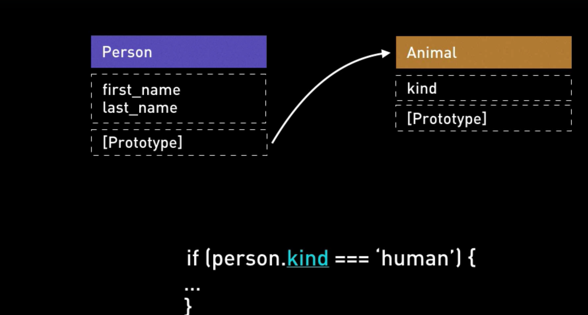

So, this works just like single parent inheritance in "class based" languages.

Every object will inherit from one of the object.

Eg: 
```js
    "use strict";

    var animal = {
    kind: 'human'
    };

    console.log(animal);

    var shubham = {};

    shubham.__proto__ = animal;

    console.log("shubham.kind: ", shubham.kind );
    console.log("animal.isPrototypeOf(shubham): ", animal.isPrototypeOf(shubham));
```
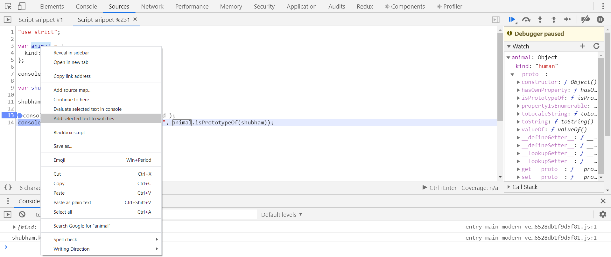
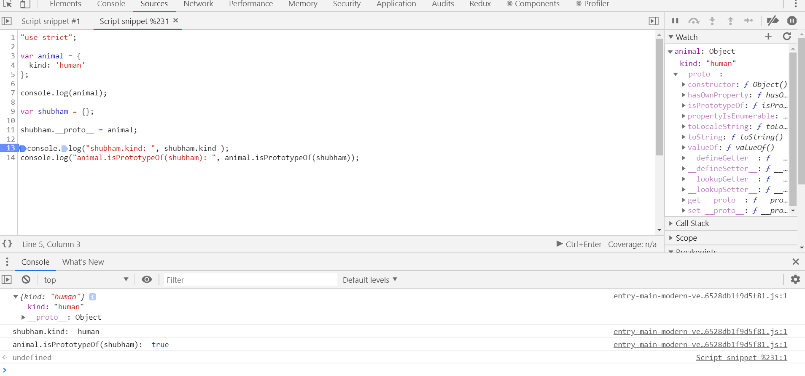

Also, lookups are dynamic. If you add a property to the prototype object or you change the property of the prototype object, that's refelected dynamically.

```js

    animal.kind = 'igloo';
    console.log(shubham.kind);
    console.log(animal.kind)

```
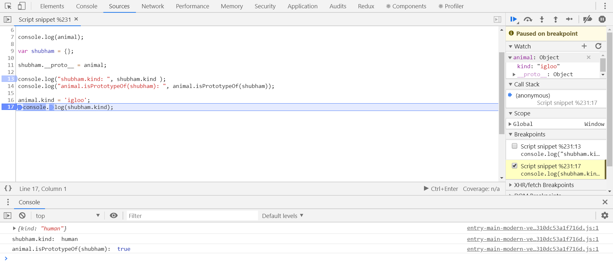

<b>Also, updating a property that previously only existed on the prototype of an object adds it to the object and not to the property to the object.</b>

Same functionalty can be achieved through the Object.create method.

 var shubham= Object.create(animal)


what object.create does is:<b> It creates a new object and assign animal as the prototype of that new object.</b>

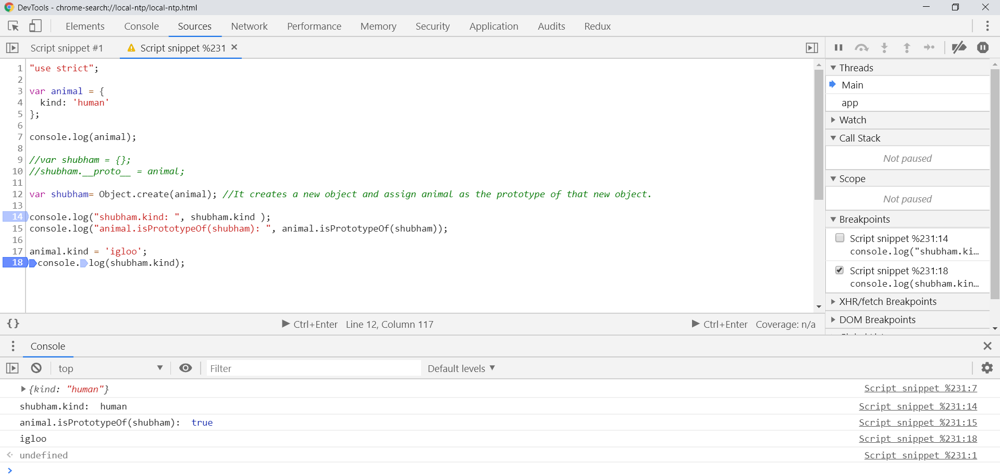
Object.create() takes object property (which you want to add) as it's 2nd parameter. 
 
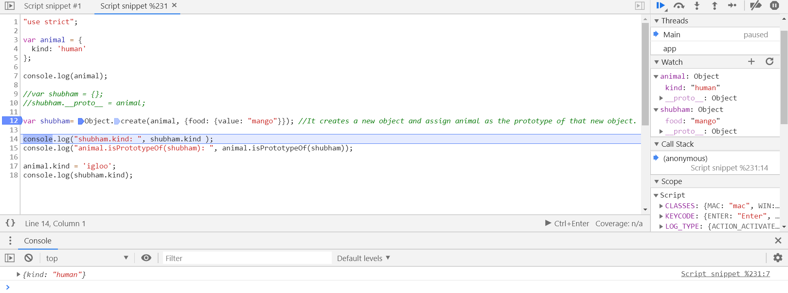

var shubham= Object.create(animal, {food: {value: "mango"}}); //It creates a new object and assign animal as the prototype of that new object. Also, it adds "food" property to the shubham object and assigns it's value as "mango".

# Inheritance in JS #


1. Prototypal
    1.1 Prototypal pattern
    1.2 Pseudo-classical pattern
2. Classical

<h6>Pseudo classical inheritance in JS: </h6>

object oriented programming and inheritance concepts in JS is hard to learn. There are no core features in of the language to support it. 

We can mimic Java and C++ OOPs by using "function constructors" and the "new keyword".

The class describes the behaviour of an object via member functions and also the state of an object via properties.

Eg:
```js
"use strict";

function Person( first_name, last_name){
    this.first_name= first_name;
    this.last_name= last_name;
}

var dude= Person("shubham", "Kushwaha");
//Uncaught TypeError: Cannot set property 'first_name' of undefined

```
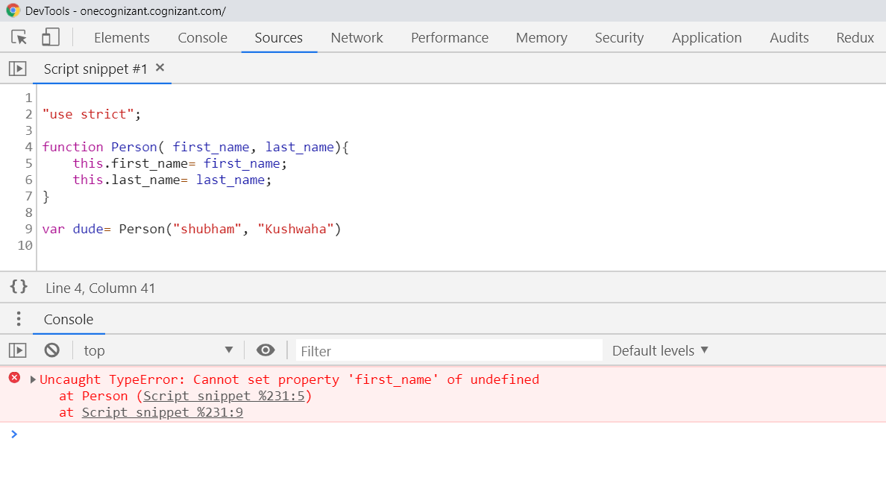


This is because by-default "this" is set to global window object but while using "use strict", it's set to undefined if used inside a function.

But instead of ding that, if we try with "new" keyword, it works fine. It's called function constructors.


```js
"use strict";

function Person( first_name, last_name){
    this.first_name= first_name;
    this.last_name= last_name;
}

var dude= new Person("shubham", "Kushwaha");

```

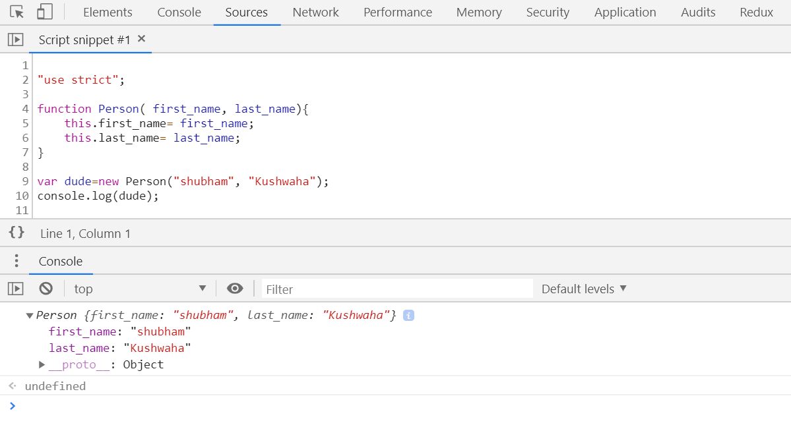

So, basically what "new" keyword is doing, it was achieved previously by:


```js
"use strict";

function Person( first_name, last_name){
    this.first_name= first_name;
    this.last_name= last_name;
}

var dude= {};
Person.call(dude, "shubham", "Kushwaha");
console.log(dude);

```
So, we can add properties onto the class same as we can add data to instance of that class. How can we have (member) functions in our class??

There are 2 ways of doing this:
1. 

```js
"use strict";

function Person( first_name, last_name){
    this.first_name = first_name;
    this.last_name = last_name;
    this.full_name = function(){
        return this.first_name + ' ' + this.last_name;
    };
};

var dude= {};
Person.call(dude, "shubham", "Kushwaha");
console.log(dude.full_name());

```

2. By using function prototype:

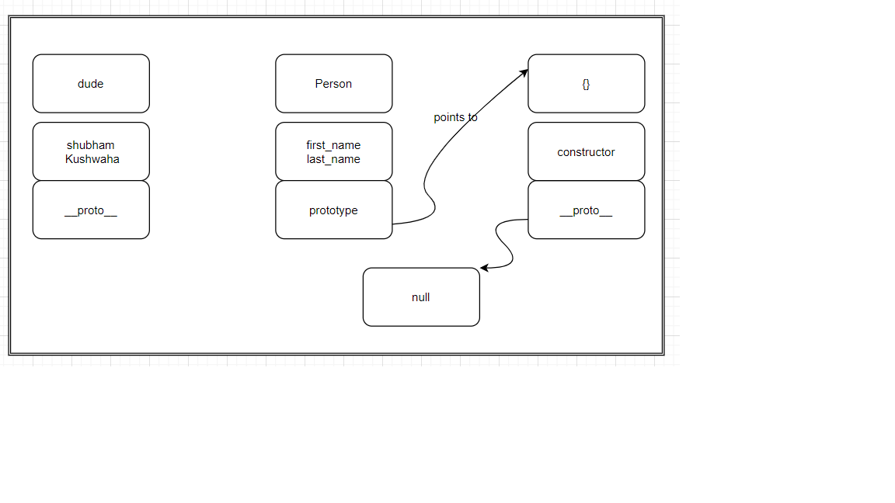

So now the question is, where the __proto__ of "dude" points to?

It points to the same object where "prototype" of "Person" is pointing. So, when the object is constructed, it ends up looking like this:

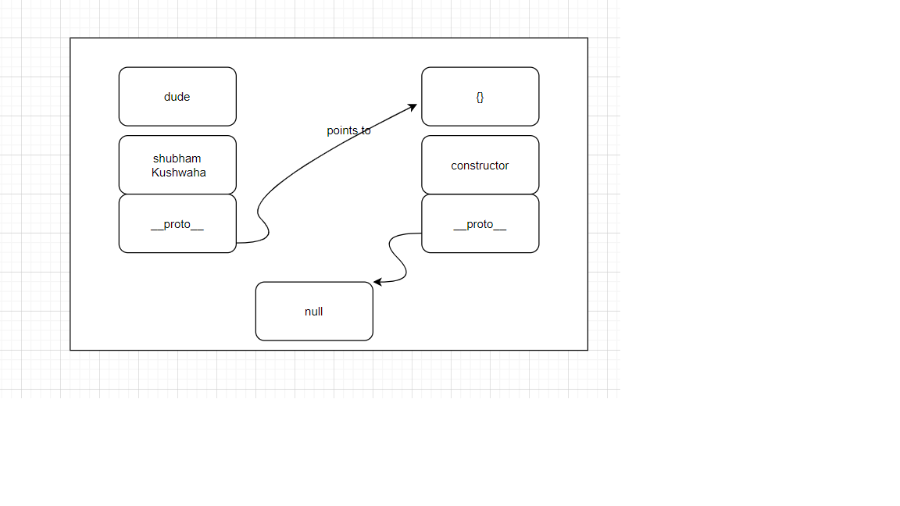

It ends up having a "prototype chain" where the "dude" instance points to the "prototype" of the "function constructor" which was used to create "dude" and again and again don the chain reaches to "null".

We can now add function to the prototype of a person which is then made available to "dude" in his prototype chain.

Eg:
```js
"use strict";

function Person( first_name, last_name){
    this.first_name = first_name;
    this.last_name = last_name;
    this.full_name = function(){
        return this.first_name + ' ' + this.last_name;
    };
};

Person.prototype.full_name_prototype = function(){
    return this.first_name + " " + this.last_name;
}

var dude = new Person("shubham", "Kushwaha");
// var dude= {};
// Person.call(dude, "shubham", "Kushwaha");
console.log(dude.full_name_prototype());

```
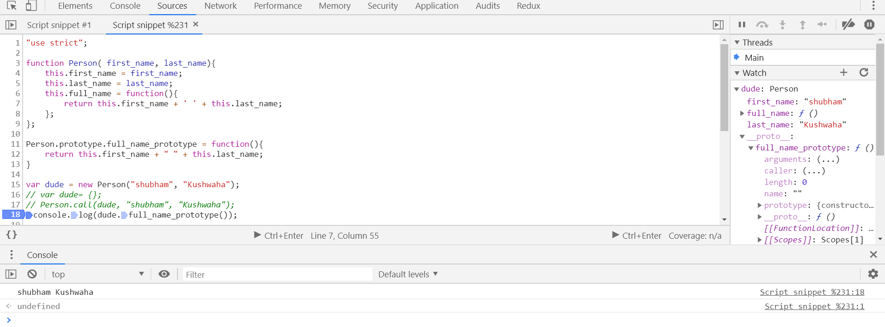

The advantage of this approach:

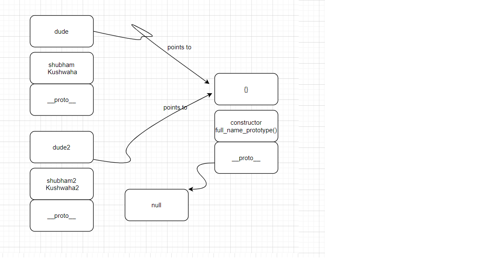
If we create multiple instances, they'll share the same prototype and eventually the function that we added on that, i.e full_name_prototype. It will save a lot og memory.

# WHich one is better approach? #

In most of the cases, approach-2 is better. But there is advantage of having the function (full_name) in the body of the function constructor because we can simulate a private member variable here. 

But still, our approach needs some modifications. Like we can still change first_name and last_name from outside the function.

```js

dude.first_name = "Dubam";

```
So, now our task is to make this immutable. We can take advantage of "closure" here.

Eg:
```js
"use strict";

function Person( first_name, last_name){
    this.first_name = first_name;
    this.last_name = last_name;
    this.full_name = function(){
        return first_name + ' ' + last_name;
    };
};

Person.prototype.full_name_prototype = function(){
    return this.first_name + " " + this.last_name;
}

var dude = new Person("shubham", "Kushwaha");
dude.first_name = "Dubam"; 
// var dude= {};
// Person.call(dude, "shubham", "Kushwaha");
console.log(dude.full_name());

```


So, we can use the function inside the body of the constructor function as private properties or private member variables by taking advantage of "closure". 


