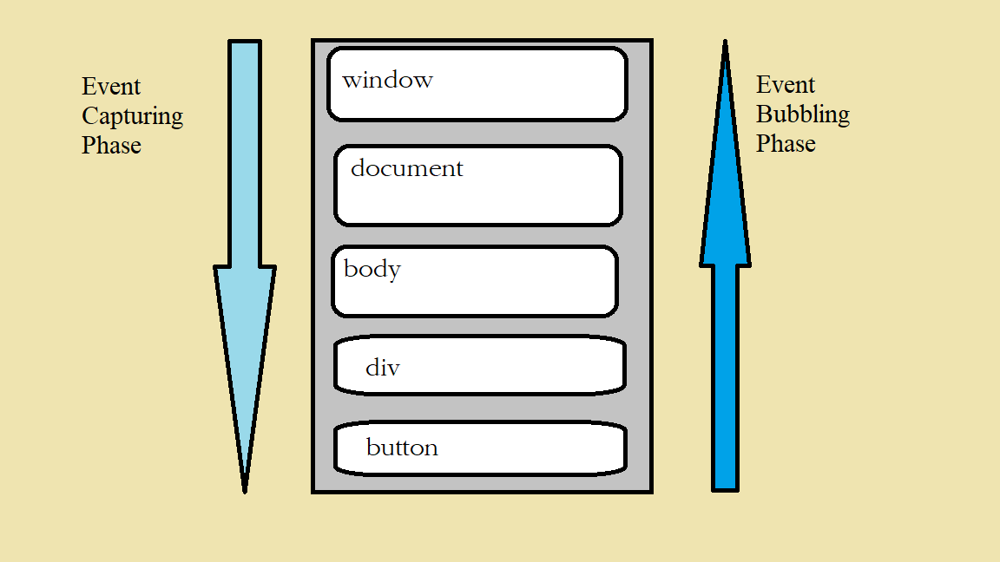

## Difference between Event Bubbling and Capturing ##

DOM representation of the HTML :

- 

window --> document --> body --> ..... div --> Button

Now, what happens if we click on the button?

### what we think? ###

We think that the the button fires an event that goes up the stack to window object.
But thats wrong.

### What actually happens? ###

- The event is fired by the root object by the window object and travels directly down the tree to the button.

- The button is what we call the target.

- Although the even goes to the target, it also touches every single parent of the button on the way down.

- So if we add event listeners to the button:

button --> div --> ... --> body --> document --> window

- So, If you had added event listeners for the click event on each of those elements, all of the listeners would have been called.

- Now, even if it reaches the bottom, it doesn't stop. It carries on and goes back up the stack to the window to the root again. It doesn't matter where you click on a page, the event always starts from the root, goes to target and then back up to the root again.

- 

- These 2 arrows shown in image are called phases.

- From root to target, it is called event capturing phase or sometimes called phase 1.

- The part that goes from target to the root is called the event bubbling phase or phase 2.

- So, all the elements on the events path will get notified twice when an event is fired.

Question here arises is: How come we haven't seen evidence of that in the code?

-  If we are understanding it right, then every event listener we've added to our code would get called twice: 1st in capturing phase, 2nd in bubbling phase.

- But till now we haven't seen any example when event listener gets called twice.

